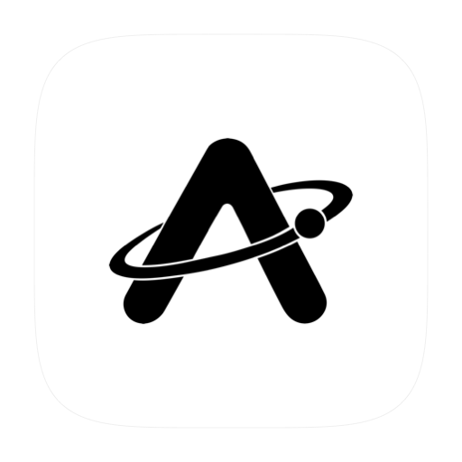
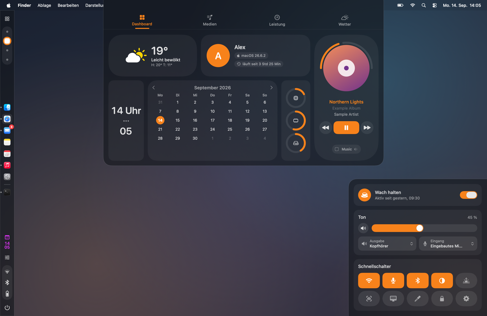

<p align="center">
  
</p>

<h1 align="center">ApolloShell</h1>

<p align="center">
  Eine Desktop-Shell für macOS 26 Tahoe: Leiste aus Liquid Glass mit Dock,
  App-Launcher, Dashboard, Kontrollzentrum und das Einstellungsfenster „Nexus“.
  In Nexus setzt du jedes Panel aus Bausteinen zusammen.
</p>

<p align="center">
  <a href="https://github.com/Silvertree2010/ApolloShell/actions/workflows/ci.yml"></a>
  <a href="https://github.com/Silvertree2010/ApolloShell/releases/latest"></a>
  <a href="https://github.com/Silvertree2010/ApolloShell/releases"></a>
  <a href="https://github.com/Silvertree2010/homebrew-apolloshell"></a>
  
  
  <a href="LICENSE"></a>
</p>

<p align="center"><a href="https://silvertree2010.github.io/ApolloShell/">Website</a> · <a href="https://apolloshell.hashnode.dev">Blog</a> · <a href="README.md">English</a> · Die ausführliche Anleitung steht in der englischen README.</p>



> [!NOTE]
> ApolloShell ist **inspiriert von der [Caelestia-Shell][caelestia]** für Hyprland.
> Es ist ein unabhängiges Projekt, **nicht mit Caelestia verbunden** und enthält
> keinen Code daraus.

Wenn dir ApolloShell gefällt, gib dem Projekt gern einen Stern auf GitHub. So
finden es auch andere Mac-Nutzer. Hintergründe zur Entwicklung stehen im
[Blog](https://apolloshell.hashnode.dev) (englisch).

## Funktionen

- **Leiste** am linken Rand, aus Bausteinen:
  - Dashboard, Spaces, Dock, Uhr, Utilities, Statussymbole und Ausschalten
  - dazu Abstände, Trennlinien, App-Knöpfe, Akku, CPU, Wetter und Medien
  - Vorlagen: Caelestia, Minimal, Nur Dock, Alles
- **Dock** mit angehefteten und laufenden Apps und Kennzeichen. Klicken, Halten,
  Rechtsklick, Ziehen, Dateien ablegen und Scrollen funktionieren wie bei Apple.
  Die angehefteten Apps bleiben mit Apples Dock abgeglichen.
- **Fensterwache**: Sie hält fremde Fenster aus dem Streifen der Leiste. Im
  Vollbild tritt die Leiste des betroffenen Bildschirms ab.
- **Launcher** mit unscharfer Suche. Häufig genutzte Apps stehen weiter oben,
  angeheftete ganz oben.
- **Dashboard** mit den Reitern Dashboard, Medien, Leistung und Wetter.
- **Utilities** unten rechts:
  - Wach halten
  - Ton mit Ausgabe und Eingang
  - Schnellschalter
  - eigene Knöpfe für Apps, Links und Kurzbefehle
- **Lautstärke-Anzeige**, **Kurzmeldungen**, **Schreibtisch-Uhr** und das
  **Sitzungsmenü** (Abmelden, Ruhezustand, Neustart, Ausschalten) mit einem
  kleinen animierten Emblem (Planet mit Mond), das auf den Knopf unter dem
  Zeiger reagiert.
- **Anbieter wählbar**: Wetter von Open-Meteo, MET Norway oder wttr.in, dazu der
  Dateimanager im Dock.

Die Oberfläche gibt es auf Deutsch und Englisch (siehe [Sprache](#sprache)).

## Voraussetzungen

- macOS 26 Tahoe oder neuer.
- Apple Silicon oder Intel. Das DMG ist universell; die Intel-Version ist noch
  nicht auf einem Intel-Mac getestet.
- Zum Selbstbauen reichen die Command Line Tools (Swift 6.2 oder neuer), Xcode
  ist nicht nötig.

## Installation

**DMG aus den [GitHub-Releases][releases]:** ApolloShell nach „Programme“
ziehen und öffnen. Beim ersten Start blockiert macOS die App. Unter
**Systemeinstellungen → Datenschutz & Sicherheit** auf **Trotzdem öffnen**
klicken. Alternativ im Terminal:

```sh
xattr -dr com.apple.quarantine /Applications/ApolloShell.app
```

Grund: Ohne Apples kostenpflichtige Entwicklermitgliedschaft gibt es keine
Beglaubigung („Notarisierung“). Selbst gebaute Apps betrifft das nicht.

**Homebrew** (baut aus dem Quelltext):

```sh
brew trust --tap Silvertree2010/apolloshell   # ab Homebrew 7
brew tap Silvertree2010/apolloshell
brew install apolloshell
```

Homebrew 7 lädt Formeln aus fremden Taps erst nach `brew trust`.

**Selbst bauen:**

```sh
git clone https://github.com/Silvertree2010/ApolloShell.git
cd ApolloShell
scripts/setup-signing.sh   # einmalig, empfohlen
./build.sh                 # baut, signiert, legt die App nach ~/Applications
```

`setup-signing.sh` legt ein eigenes Signaturzertifikat an. So bleibt die
Bedienungshilfen-Freigabe über Neubauten und Updates hinweg erhalten.
Läuft ApolloShell schon, beendet `build.sh` es und öffnet den neuen Build.
Startet es über einen eigenen launchd-Agent, gehört
`APOLLOSHELL_LAUNCHD_LABEL=<Label>` in eine `.local.env` neben `build.sh` (von
git ignoriert), dann startet `build.sh` diesen Agent neu.

**Beim Anmelden starten:** in der Einführung oder in Nexus > Allgemein
einschalten. ApolloShell trägt sich als Anmeldeobjekt ein (`SMAppService`,
sichtbar unter Systemeinstellungen > Allgemein > Anmeldeobjekte). In
Entwicklungs-Builds und wenn schon ein eigener launchd-Agent ApolloShell
startet, bleibt der Schalter gesperrt.

## Berechtigungen

Beim ersten Start erklärt eine kurze **Einführung** (vier Schritte,
überspringbar) die Freigaben, öffnet den richtigen Bereich der
Systemeinstellungen und zeigt ein Häkchen, sobald die Bedienungshilfen
erteilt sind. Später: Nexus > Über > „Einführung zeigen“.

- **Bedienungshilfen** braucht ApolloShell für:
  - die Fensterwache
  - die Fensterliste und Kennzeichen im Dock
  - Klicks auf Spaces
  - Tastenaktionen in den Utilities
- **Automation → System Events** braucht es für Abmelden, Neustart und
  Ausschalten. macOS fragt beim ersten Mal selbst nach.
- **Wach halten bei zugeklapptem Deckel** ist eine eigene Einstellung (Nexus >
  Schnellaktionen, für neue Installationen aus). Sie braucht root für
  `pmset -a disablesleep`. ApolloShell versucht erst `sudo -n`, sonst fragt macOS
  einmal nach einem Administrator-Passwort. Dabei legt ApolloShell
  `/etc/sudoers.d/apolloshell` an, eine mit `visudo` geprüfte Regel, die nur
  `pmset -a disablesleep 1` und `0` für deinen Benutzer ohne Passwort erlaubt.
  Danach fragt nichts mehr, auch nicht beim Akku-Schutz oder Beenden. Nexus >
  Schnellaktionen zeigt die Regel und kann sie entfernen. Wer ablehnt, bekommt
  Wach halten nur aufgeklappt, und die Karte sagt das.

**Apple-Dock ausblenden, solange ApolloShell läuft** (Nexus > Allgemein, für
neue Installationen aus) sichert die bisherigen `autohide`-Werte von
`com.apple.dock` und schreibt sie beim Beenden oder Ausschalten der
Einstellung zurück. Das eigene Dock der Leiste bleibt davon unberührt. Ein
Abbruch per `SIGKILL` (kein normales Beenden) lässt Apples Dock versteckt,
bis ApolloShell wieder normal startet und endet.

## Datenschutz

- Keine Telemetrie.
- Nur Wetterabfragen gehen ins Netz. Sie senden die Koordinaten des gewählten
  Orts an den gewählten Anbieter.
- Die Ortssuche sendet den Suchtext an Open-Meteo.
- Sonst verlässt nichts den Mac.

## Private Schnittstellen

ApolloShell nutzt nicht dokumentierte Schnittstellen von macOS:

- SkyLight
- CoreBrightness
- MediaRemote über mediaremote-adapter
- `_AXUIElementCreateWithRemoteToken` und `_AXUIElementGetWindow`
- Apples Dock-Einstellungen (angeheftete Apps, und wenn eingeschaltet auch das
  Ausblenden des Docks)

macOS-Updates können einzelne Funktionen stilllegen. Details stehen in der
[englischen README](README.md#good-to-know).

## Tastenkürzel

Einstellbar in Nexus > Tastenkürzel: ins Feld klicken, neue Kombination
drücken, gilt sofort. Nexus meldet, wenn ein Kürzel schon vergeben ist (andere
Aktion, macOS, andere App) oder ⌥ mit einer Buchstabentaste ein Sonderzeichen
blockieren würde.

| Vorgabe | Aktion |
| --- | --- |
| ⌥Space | Launcher (Spotlight bleibt auf ⌘Space) |
| ⌃⌥D | Dashboard |
| ⌃⌥U | Utilities |
| ⌃⌥, | Nexus |

⌃⌥ statt ⌥ allein, weil ⌥U auf vielen Belegungen die Umlaut-Taste ist und ⌥,
das Zeichen « tippt. Die Vorlage „Hyper-Taste“ nimmt F20 und ⌃⌥⇧⌘ + D / U / ,
(passend zu Karabiner-Elements). Wer schon vorher eine `settings.json` hatte,
behält diese Belegung.

## Sprache

ApolloShell gibt es auf Deutsch und Englisch. Standardmässig folgt es der
Sprachreihenfolge von macOS. Unter Nexus › Allgemein › Sprache lässt sich eine
eigene Sprache nur für ApolloShell wählen, danach mit dem Knopf dort neu
starten. Die Übersetzungen liegen in `Support/Localization/<Sprache>/*.strings`,
die Ausgangssprache ist Deutsch.

## Dank und Lizenz

- Design nach der [Caelestia-Shell][caelestia] (GPL-3.0), ohne übernommenen Code
- [mediaremote-adapter][mra] von ungive (BSD-3-Clause)
- Wetterdaten: Open-Meteo, MET Norway und wttr.in
- SF Symbols von Apple

Lizenz: [MIT](LICENSE) © 2026 Silvertree2010. Hinweise zu Fremdcode stehen in
[THIRD_PARTY_NOTICES.md](THIRD_PARTY_NOTICES.md).

[releases]: https://github.com/Silvertree2010/ApolloShell/releases/latest
[caelestia]: https://github.com/caelestia-dots/shell
[mra]: https://github.com/ungive/mediaremote-adapter
