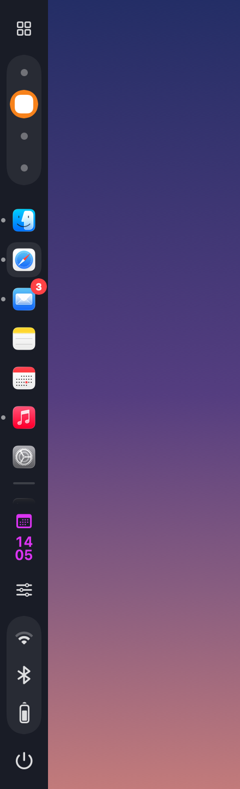
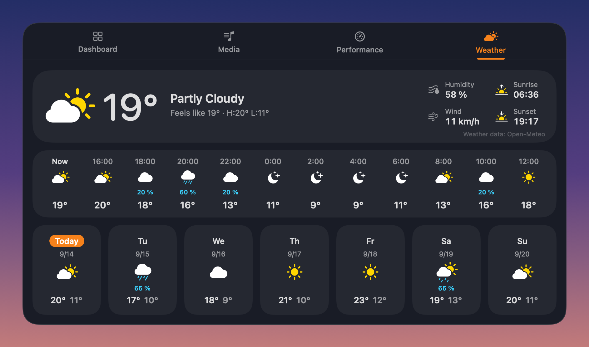
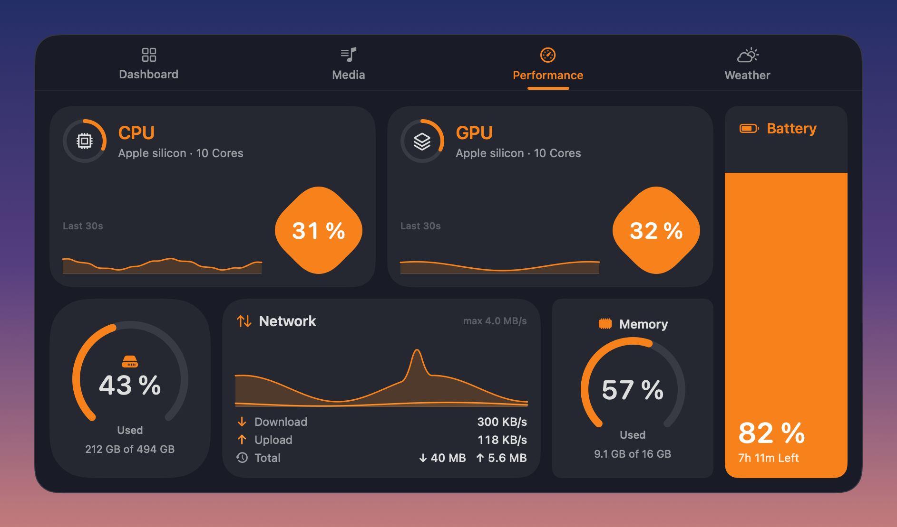
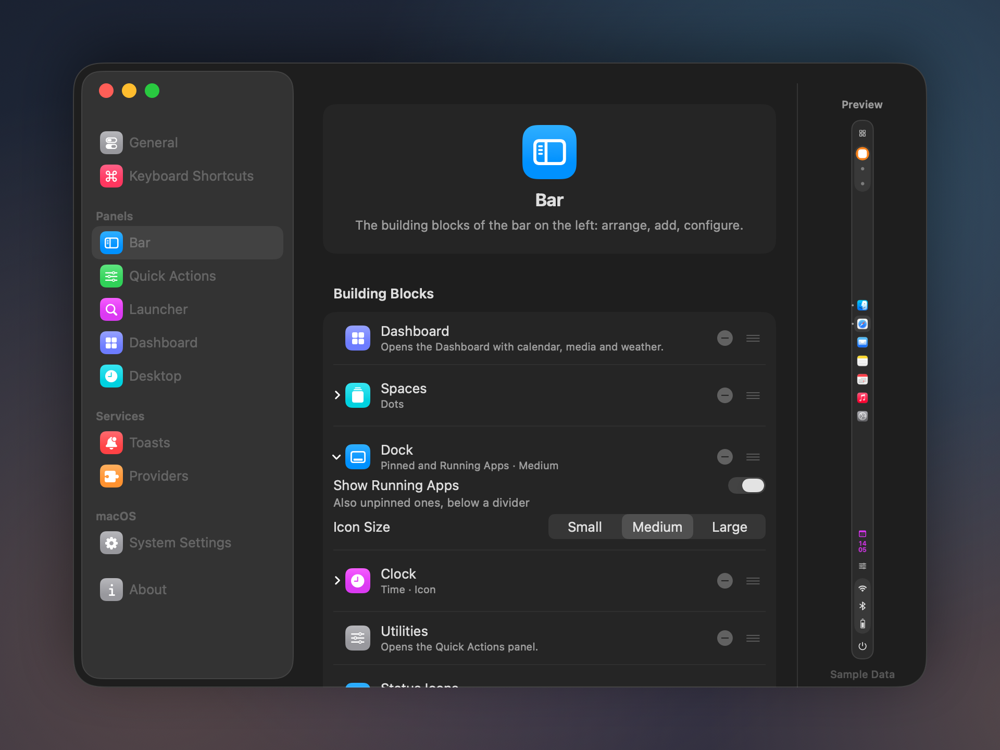

<p align="center">
  
</p>

<h1 align="center">ApolloShell</h1>

<p align="center">
  A desktop shell for macOS 26 Tahoe: a Liquid Glass sidebar with a modular dock,
  an app launcher, a dashboard, a control centre and a settings window where
  every panel is built from blocks.
</p>

<p align="center">
  <a href="https://github.com/Silvertree2010/ApolloShell/actions/workflows/ci.yml"></a>
  <a href="https://github.com/Silvertree2010/ApolloShell/releases/latest"></a>
  <a href="https://github.com/Silvertree2010/ApolloShell/releases"></a>
  <a href="https://github.com/Silvertree2010/homebrew-apolloshell"></a>
  
  
  <a href="LICENSE"></a>
</p>

<p align="center"><a href="README.de.md">Deutsch</a></p>


> [!NOTE]
> **ApolloShell is inspired by the [Caelestia shell][caelestia]** for Hyprland on Linux:
> its layout, panels and many measurements follow Caelestia's design.
> It is an independent project and **not affiliated with or endorsed by** the
> Caelestia authors. It contains no Caelestia code.

> [!IMPORTANT]
> Version 0.1.1 is an early release. The interface is in English and German
> (see [Language](#language)). ApolloShell relies on private macOS interfaces
> (see [below](#private-apis)) and may break with macOS updates.

## Contents

- [Features](#features)
- [Screenshots](#screenshots)
- [Requirements](#requirements)
- [Installation](#installation)
- [Permissions](#permissions)
- [Privacy](#privacy)
- [Private APIs](#private-apis)
- [Keyboard shortcuts](#keyboard-shortcuts)
- [Configuration (Nexus)](#configuration-nexus)
- [Language](#language)
- [Credits](#credits)
- [License](#license)

## Features

ApolloShell runs next to Finder, the menu bar and Apple's Dock. It adds panels
to the screen edges; it does not replace the window manager.

- **Sidebar** at the left screen edge, built from blocks you can rearrange:
  dashboard button, Spaces, dock, clock, utilities button, status icons
  (Wi-Fi, Bluetooth, battery, each with a detail popout) and power button, plus
  spacers, dividers, app buttons, battery, CPU, weather and media. Presets:
  *Caelestia*, *Minimal*, *Dock only*, *Everything*.
- **Dock in the sidebar**: pinned and running apps, badges, and mouse handling
  like Apple's Dock: click, click-and-hold or right-click for the menu (windows
  on all Spaces, the app's "New …" commands), drag to reorder, drop files on an
  app, scroll to cycle its windows. Pinned apps are kept in sync with Apple's
  Dock.
- **Window guard**: keeps other apps' windows out of the sidebar's strip. On a
  screen that shows a full-screen app, the sidebar steps aside.
- **Launcher**: fuzzy search over installed apps, ranked by how often you
  open them, with pinned apps on top.
- **Dashboard** sliding down from the top edge, with four tabs:
  - *Dashboard*: weather, user, clock, calendar, resources, now playing
  - *Media*: now playing with cover art and controls
  - *Performance*: CPU, GPU, memory, storage, network and battery, with a 30-second history
  - *Weather*: hourly and 7-day forecast, sunrise and sunset

  Cards and tabs can be rearranged; presets included.
- **Utilities**, a control centre in the bottom-right corner:
  - keep the Mac awake
  - sound: volume, output and input device
  - quick toggles: Wi-Fi, microphone, Bluetooth, dark mode, Night Shift,
    screenshot, show desktop, colour picker, lock screen, settings, display
    sleep and hide apps
  - your own buttons: open an app, open a link, run a Shortcut
- **On-screen display** for volume changes, **toasts** for charger, battery
  levels and audio devices, a **desktop clock** behind your windows, and a
  **session menu** (log out, sleep, restart, shut down) that dims the screen,
  with a small animated emblem (a planet and its moon) that reacts to the
  button you point at.
- **Nexus**, the settings window. See [Configuration](#configuration-nexus).
- **Selectable providers**: weather from Open-Meteo (default), MET Norway or
  wttr.in. You also choose the file manager shown at the top of the dock.

## Screenshots

Rendered with sample data. Liquid Glass appears as a dark stand-in, because the
images are rendered off-screen.

| Sidebar (Caelestia preset) | Utilities |
| --- | --- |
|  |  |

| Dashboard | Weather |
| --- | --- |
|  |  |

| Performance | Launcher |
| --- | --- |
|  |  |

**Nexus: editing the sidebar**



## Requirements

- **macOS 26 Tahoe** or later. ApolloShell uses Liquid Glass (`NSGlassEffectView`),
  which does not exist on older versions.
- **Apple silicon or Intel.** The release disk image contains a universal binary.
  The Intel build compiles and links, but it has not been tested on an Intel Mac
  yet. Reports are welcome.
- **Building from source** needs only the Xcode **Command Line Tools** with the
  macOS 26 SDK (Swift 6.2 or newer). Xcode itself is not needed.

## Installation

### A) Disk image from GitHub Releases

1. Download `ApolloShell-<version>.dmg` from the [latest release][releases].
2. Open it and drag **ApolloShell** onto **Applications**.
3. Open ApolloShell. macOS will refuse the first time ("Apple could not verify …").
   Go to **System Settings → Privacy & Security**, scroll down to *Security*,
   click **Open Anyway** next to ApolloShell and confirm. You only need to do
   this once per downloaded version.

   Alternatively, remove the download quarantine in Terminal:

   ```sh
   xattr -dr com.apple.quarantine /Applications/ApolloShell.app
   ```

**Why this step?** macOS opens downloaded apps without asking only if Apple has
*notarised* them, and notarisation requires a paid Apple Developer membership.
ApolloShell is a free project without one. The app is code-signed, but not with
a certificate Apple knows. If you prefer not to run a prebuilt binary, use
Homebrew or build it yourself. Apps built on your own Mac carry no quarantine
flag, so this step does not apply.

### B) Homebrew (builds from source)

```sh
brew trust --tap Silvertree2010/apolloshell   # Homebrew 7 and newer
brew tap Silvertree2010/apolloshell
brew install apolloshell
```

Homebrew 7 loads formulae from third-party taps only after `brew trust`. The formula compiles ApolloShell on your Mac with the Command Line Tools and
installs `ApolloShell.app` into the Homebrew prefix. `brew info apolloshell` shows
the caveats: how to link it into `~/Applications`, and how to get a stable
signature (next section).

### C) Build from source

```sh
xcode-select --install          # once, if the Command Line Tools are missing
git clone https://github.com/Silvertree2010/ApolloShell.git
cd ApolloShell
scripts/setup-signing.sh        # once; optional, but recommended
./build.sh
```

- `./build.sh` builds a release binary, puts together and signs
  `ApolloShell.app` (with `scripts/assemble-app.sh`), and copies it to
  `~/Applications/ApolloShell.app`. Start it from there. If ApolloShell is
  already running, `build.sh` quits it and opens the new build. If you start
  it with your own launchd agent, put `APOLLOSHELL_LAUNCHD_LABEL=<label>` in a
  `.local.env` next to `build.sh` (ignored by git), and `build.sh` restarts
  that agent instead.
- `scripts/setup-signing.sh` creates a self-signed code-signing certificate in
  your login keychain. macOS asks once for your password to trust it for code
  signing.

  **Why:** macOS ties the Accessibility permission to the app's code signature.
  Without this certificate every build gets a new ad-hoc signature, so you would
  have to grant Accessibility again after each build or update. With the
  certificate, the signature and the permission stay the same.
- `scripts/make-dmg.sh` builds the universal disk image into `dist/`.
  `ARCHS=arm64 scripts/make-dmg.sh` builds an Apple-silicon-only image.
- **Start at login:** switch it on in the welcome guide or in Nexus → General.
  ApolloShell registers itself as a login item (`SMAppService`), so it also
  shows up under System Settings → General → Login Items. The switch is locked
  in development builds (no `.app` bundle) and when a launchd agent of your own
  already starts ApolloShell, so it never runs twice.

## Permissions

On first launch, a short **welcome guide** (four steps, skippable) explains
both permissions, opens the right System Settings pane for Accessibility and
shows a check mark as soon as it is granted. macOS asks for System Events
itself the first time you log out, restart or shut down from the session menu.
The guide is also under Nexus → About → *Show introduction*; Nexus → General
shows the current status. You can review everything under
**System Settings → Privacy & Security**.

| Permission | What ApolloShell uses it for | Without it |
| --- | --- | --- |
| **Accessibility** | **Window guard**: moves windows out of the sidebar strip. **Dock window list**: the window menu and scrolling through an app's windows, including windows on other Spaces. **Dock badges**: read from Apple's Dock. **Clicking a Space**: sends the system shortcut ⌃← / ⌃→. **Key actions** in Utilities: show desktop, screenshot toolbar and lock screen trigger the system's own shortcuts. | The sidebar still works, but windows can slide under it and those actions do nothing. |
| **Automation → System Events** | **Log out, restart, shut down** from the session menu, the same way the Apple menu does it (apps can still ask to save). It is also the fallback for the dark-mode toggle. | Those buttons fail. |

**Optional:** *Keep awake* holds a normal "prevent idle sleep" assertion, which
needs no permission. Staying awake **with the lid closed** is a separate
setting (Nexus → Utilities → *Keep awake*, off by default). It runs
`/usr/bin/pmset -a disablesleep 1`, which needs root:

- ApolloShell first tries `sudo -n` (only works if `sudoers` allows that
  command without a password).
- Otherwise macOS asks once for an administrator password. The same prompt
  adds `/etc/sudoers.d/apolloshell`, a rule that allows only
  `pmset -a disablesleep 1` and `pmset -a disablesleep 0` for your user. The
  rule is checked with `visudo` before it is put in place. After that, nothing
  asks again, so ApolloShell can also switch lid sleep back on at 10 % battery
  or when it quits. Nexus → Utilities shows the rule and can remove it.
- If you cancel, keep awake still works while the lid is open, and the card
  says so.

ApolloShell only resets what it set itself, stops keeping awake on battery at
10 %, and cleans up after a crash on the next launch.

**If an update breaks Accessibility:** after an update, ApolloShell may be
ticked under Accessibility and still get no access. Remove it from the list
(the "–" button), add it again and restart ApolloShell. `scripts/setup-signing.sh`
prevents this for builds you make yourself.

## Privacy

- **No telemetry, no analytics, no crash reporting, no accounts.**
- **Weather** is the only network traffic.
  - Forecast requests send the coordinates of the place you chose (rounded to
    four decimals, about 10 m) to the provider you selected: Open-Meteo,
    MET Norway or wttr.in.
  - Searching for a place in Nexus sends the text you type to Open-Meteo's
    geocoding service.
  - Requests carry a User-Agent with the app name and version (MET Norway
    requires one).

  **Nothing else leaves your Mac.**
- *Now playing* information is read locally (see mediaremote-adapter below).
- Settings stay local in `~/Library/Application Support/ApolloShell/`:
  `settings.json`, pinned apps, launch counts for the launcher ranking, the
  weather favorites, and (while Apple's Dock is hidden) the original
  `autohide` values in `apple-dock.json`. To reset ApolloShell, delete that
  folder.

## Private APIs

ApolloShell uses undocumented macOS interfaces for things that have no public
API. It loads them at runtime and checks that they exist, so a missing interface
switches the feature off instead of crashing. **A macOS update may still change
or remove them.** This is also why ApolloShell cannot be in the Mac App Store.

| Interface | Used for |
| --- | --- |
| **SkyLight** (`CGSCopyManagedDisplaySpaces`, `CGSCopySpacesForWindows`, `SLSGet/SetAppearanceThemeLegacy`) | Reading the list of Spaces and which screen shows a full-screen app; telling windows on other Spaces from windows an app only keeps in memory; toggling dark mode |
| **CoreBrightness** (`CBBlueLightClient`) | Reading and toggling Night Shift |
| **MediaRemote**, via [mediaremote-adapter][mra] | Now playing. Since macOS 15.4, MediaRemote only answers Apple-signed processes, so the adapter runs inside `/usr/bin/perl` |
| **`_AXUIElementCreateWithRemoteToken`**, **`_AXUIElementGetWindow`** (HIServices) | Listing an app's windows on other Spaces; matching them to the system window list |
| **Apple's Dock preferences** (`com.apple.dock`, `persistent-apps`) | Reading, and when you change them in the sidebar dock also writing, the pinned apps |
| **Apple's Dock preferences** (`com.apple.dock`, `autohide` and related keys) | Hiding Apple's own Dock while ApolloShell runs, when turned on in Nexus → General |

## Keyboard shortcuts

The four global shortcuts can be changed in **Nexus → Keyboard Shortcuts**
(*Tastenkürzel*): click a field and press the new combination. Changes apply
immediately. Nexus says when a shortcut is already used by another action,
by macOS (for example ⌘Space for Spotlight) or by another app, or when ⌥ plus
a letter would stop you from typing a special character.

| Default | Action |
| --- | --- |
| **⌥Space** | Show or hide the launcher. Spotlight keeps ⌘Space. |
| **⌃⌥D** | Dashboard |
| **⌃⌥U** | Utilities |
| **⌃⌥,** | Nexus (settings) |
| **↑ / ↓**, **Return**, **Esc** | In the launcher: move the selection, open the app, close |
| **Esc** | Close a status popout |

Why ⌃⌥ and not ⌥ alone: on many keyboard layouts ⌥U is the umlaut dead key
and ⌥, types «. A global shortcut would swallow those characters. Alfred and
Raycast also use ⌥Space by default; if one of them is running, Nexus shows the
launcher shortcut as not active, and you can pick another one.

The **Hyper key** preset uses F20 for the launcher and ⌃⌥⇧⌘ + D / U / , for
the rest. It suits tools like Karabiner-Elements that turn a spare key into F20
or, held down, into ⌃⌥⇧⌘. Installs that already had a `settings.json` before
configurable shortcuts keep these bindings.

The sidebar buttons open the dashboard, utilities and session menu with the mouse.

## Configuration (Nexus)

Open Nexus with **⌃⌥,** (default), with the settings button in Utilities, or by
opening ApolloShell again. Only one copy runs at a time, and a second launch
just brings up Nexus. Changes apply immediately and are saved to
`settings.json`.

| Page | What you can set |
| --- | --- |
| **General** | Language, start at login, status of the permissions, hide Apple's Dock while ApolloShell runs |
| **Keyboard Shortcuts** | The four global shortcuts, presets |
| **Sidebar** | Arrange, add and configure blocks, with a live preview and presets |
| **Utilities** | Cards and quick toggles, including your own app, link and Shortcut buttons; keep awake with the lid closed |
| **Launcher** | Pinned apps and their order |
| **Dashboard** | Tabs and cards, plus weather favorites (search, add, reorder, choose) |
| **Desktop** | The desktop clock |
| **Toasts** | Which events show a toast |
| **Providers** | Weather source and the file manager in the dock |
| **System Settings** | Links to what macOS itself manages (network, Bluetooth, sound, wallpaper, language) |
| **About** | Version and system, and the welcome guide again |

**Launcher only:** `defaults write <bundle id> launcherOnly -bool true` and a
restart leave out everything except the launcher and its shortcut.

**Hide Apple's Dock while ApolloShell runs** (Nexus → General, off by
default) writes `autohide`, `autohide-delay` and `autohide-time-modifier` in
`com.apple.dock` so Apple's own Dock never appears, and restores whatever was
there before when ApolloShell quits or the setting goes off again. The
sidebar's own dock is unaffected. If ApolloShell is killed with `SIGKILL`
(not a normal quit), Apple's Dock stays hidden until ApolloShell starts and
ends normally again.

## Language

ApolloShell speaks English and German. It follows the macOS language order by
default. To pick one for ApolloShell alone, go to Nexus › General › Language
and restart it with the button there. Translations live in
`Support/Localization/<language>/*.strings`, and German is the source
language. `scripts/check-l10n.py` lists UI text that has no translation yet.
New languages are welcome, see [CONTRIBUTING](CONTRIBUTING.md).

## Credits

- **[Caelestia shell][caelestia]** (GPL-3.0) is the design this project follows:
  layout, panels, proportions and motion. ApolloShell reimplements that design
  in Swift for macOS and copies no code. It is not affiliated with Caelestia.
- **[mediaremote-adapter][mra]** by ungive (Jonas van den Berg and contributors),
  BSD-3-Clause, is bundled for *now playing*.
- **Weather data**:
  - [Open-Meteo][open-meteo], CC BY 4.0; the free API is for non-commercial use
  - [MET Norway][met], CC BY 4.0
  - [wttr.in][wttr]

  The dashboard names the source of the data it shows.
- **SF Symbols** by Apple, used through the system frameworks.

Full notices: [THIRD_PARTY_NOTICES.md](THIRD_PARTY_NOTICES.md).

## License

[MIT](LICENSE) © 2026 Silvertree2010. Bundled third-party code keeps its own
license (see [THIRD_PARTY_NOTICES.md](THIRD_PARTY_NOTICES.md)).

Contributions are welcome, see [CONTRIBUTING.md](CONTRIBUTING.md).

[releases]: https://github.com/Silvertree2010/ApolloShell/releases/latest
[caelestia]: https://github.com/caelestia-dots/shell
[mra]: https://github.com/ungive/mediaremote-adapter
[open-meteo]: https://open-meteo.com/
[met]: https://api.met.no/
[wttr]: https://wttr.in/
