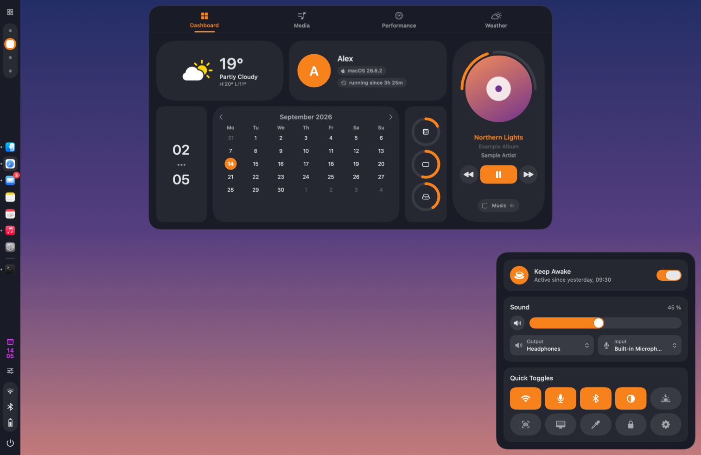
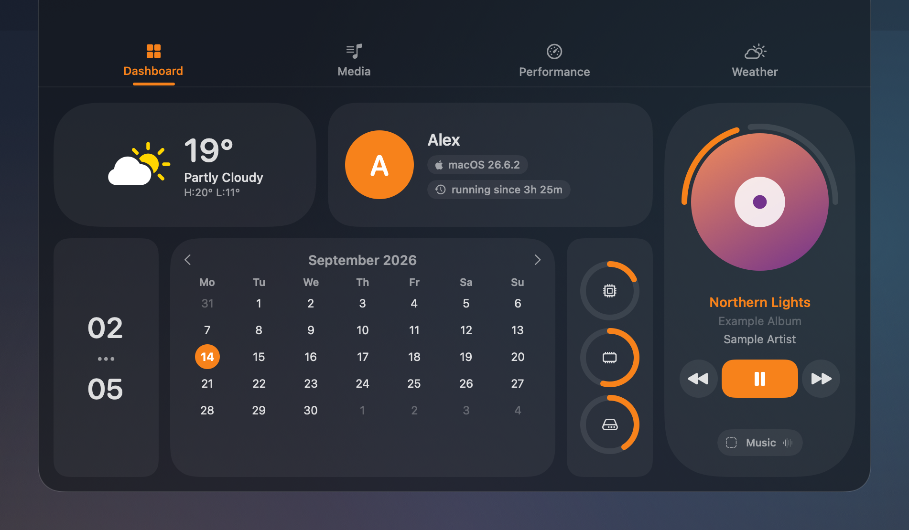
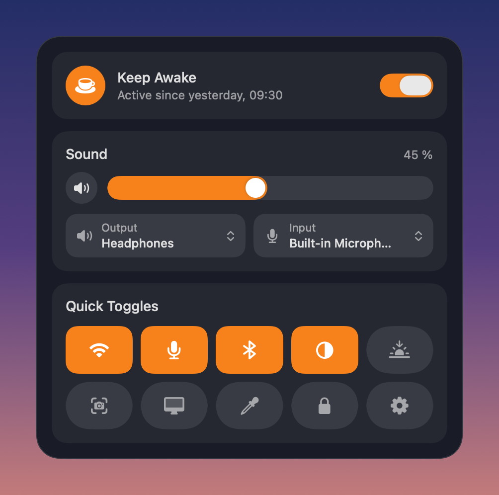
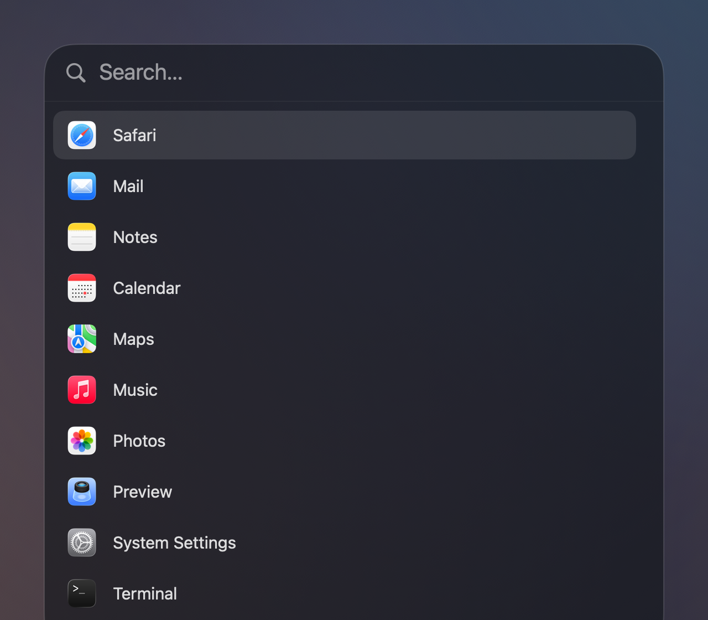
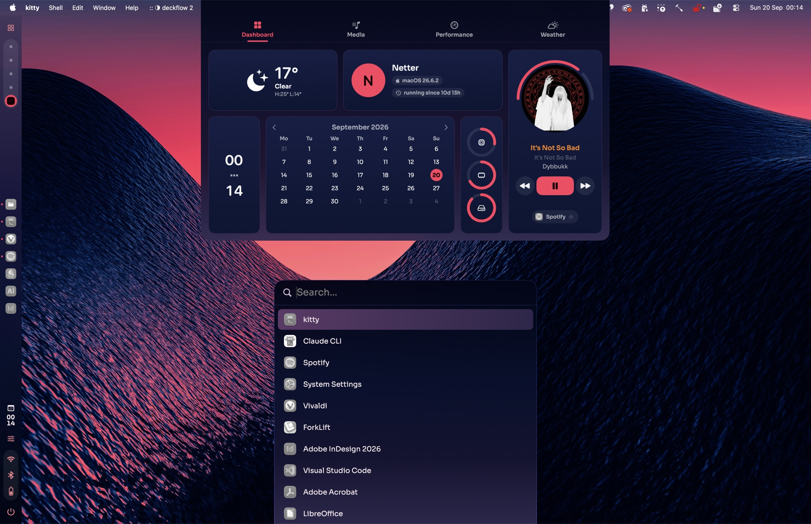
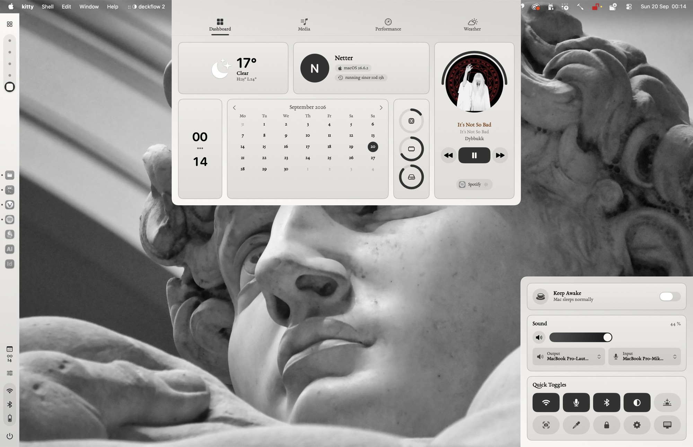
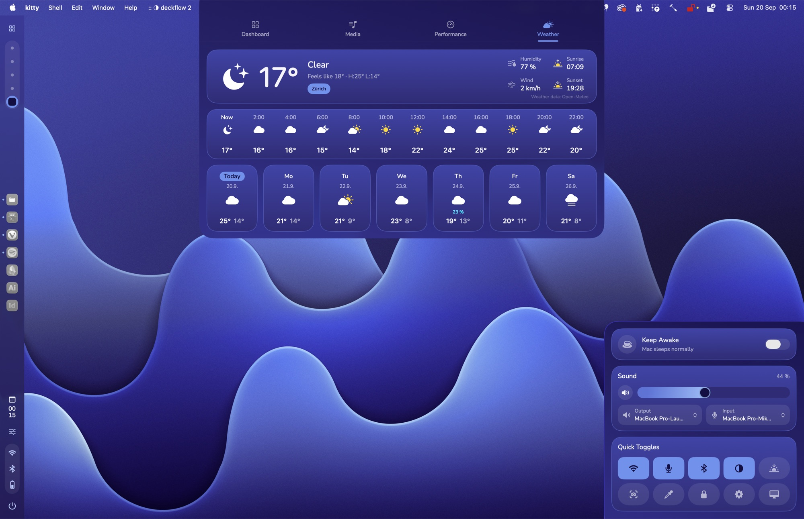

<p align="center">
  
</p>

<h1 align="center">ApolloShell</h1>

<p align="center">
  A desktop shell for macOS 26 Tahoe: a sidebar with its own dock, a launcher,
  a dashboard and a control centre, all built from blocks you arrange yourself.
</p>

<p align="center">
  <a href="https://github.com/Silvertree2010/ApolloShell/actions/workflows/ci.yml"></a>
  <a href="https://github.com/Silvertree2010/ApolloShell/releases/latest"></a>
  <a href="https://github.com/Silvertree2010/ApolloShell/releases"></a>
  <a href="https://github.com/Silvertree2010/homebrew-apolloshell"></a>
  
  
  <a href="LICENSE"></a>
  <a href="https://www.producthunt.com/products/apolloshell"></a>
</p>

<p align="center"><a href="https://silvertree2010.github.io/ApolloShell/">Website</a></p>



ApolloShell brings the look of Linux shells like [Caelestia][caelestia] to the
Mac. It doesn't replace Finder or the window manager. It adds panels to the
edges of your screen and stays out of the way otherwise.

> [!NOTE]
> This is an early release. It relies on private macOS interfaces, so a macOS
> update can break parts of it. The design follows Caelestia, but ApolloShell
> is an independent project and contains no Caelestia code.

If you like it, a star on GitHub helps other Mac users find it.

## What's inside

- **Sidebar** on the left edge with Spaces, a clock, status icons and a power
  button. Add, remove and reorder blocks, or start from a preset.
- **Dock** in the sidebar with your pinned and running apps. Clicks, menus,
  drag and drop and badges work like in Apple's Dock.
- **Launcher.** Press ⌥Space, type, hit Return. Apps you use often come first.
- **Dashboard** from the top edge: weather, calendar, system stats and what's
  playing.
- **Control centre** in the bottom-right corner: keep awake, sound, Wi-Fi, dark
  mode, Night Shift, a colour picker and your own buttons.
- **Themes** as one CSS file: colours, gradients, fonts and sizes for the
  whole shell, applied the moment you save the file.
- **Nexus**, the settings app, where every panel can be rearranged.
- Volume display, notifications for power and audio, a desktop clock and a
  session menu.
- **Keeps itself up to date** (the `.dmg` build), or says when a new version
  is out (Homebrew).

| Dashboard | Control centre | Launcher |
| --- | --- | --- |
|  |  |  |

## Install

You need **macOS 26 Tahoe** or later, on Apple silicon or Intel.

**Download.** Get the `.dmg` from the [latest release][releases] and drag
ApolloShell into Applications. The app isn't notarised (that needs a paid Apple
developer account), so macOS blocks the first launch. Open **System Settings →
Privacy & Security** and click **Open Anyway**, or run:

```sh
xattr -dr com.apple.quarantine /Applications/ApolloShell.app
```

**Homebrew.** Builds it from source on your Mac:

```sh
brew trust --tap Silvertree2010/apolloshell   # Homebrew 7 and newer
brew tap Silvertree2010/apolloshell
brew install apolloshell
```

**From source.** Only the Command Line Tools are needed, no Xcode:

```sh
git clone https://github.com/Silvertree2010/ApolloShell.git
cd ApolloShell
scripts/setup-signing.sh   # once, keeps permissions across rebuilds
./build.sh
```

More about building and testing is in [CONTRIBUTING.md](CONTRIBUTING.md).

## Themes

A theme is a CSS file in
`~/Library/Application Support/ApolloShell/themes`: colours, sizes, fonts and
gradients as `--apollo-*` tokens, a dark-mode block, and nothing else - no
scripting, no selectors of your own. Pick one in **Nexus > Themes**. Saving
the file applies it at once, and anything that could not be read falls back
to the built-in value and is listed on that page. The format and every token
are in [docs/THEMES.md](docs/THEMES.md).

The same shell, three themes. Colours, fonts, corners, sidebar width and dock
size all come out of the theme file.

| Afterglow | Marble | Tide |
| --- | --- | --- |
|  |  |  |

## Updates

The `.dmg` build keeps itself up to date: it checks once a day in the
background, downloads a new version when it finds one, and installs it the
next time the app quits. Nexus also offers **Restart now** as soon as an
update is waiting, because a shell rarely quits on its own. Both switches are
on by default and can be turned off in **Nexus > Updates**.

A Homebrew install belongs to Homebrew, so ApolloShell never replaces itself
there. It says when a new version is out; you install it with:

```sh
brew upgrade apolloshell
```

## Shortcuts

| Keys | Opens |
| --- | --- |
| ⌥Space | Launcher |
| ⌃⌥D | Dashboard |
| ⌃⌥U | Control centre |
| ⌃⌥, | Nexus |

You can change them in Nexus → Keyboard Shortcuts.

## Good to know

**Permissions.** A short welcome guide walks you through them on first launch.

- *Accessibility* keeps windows out of the sidebar and powers the dock's window
  list. Without it, ApolloShell still runs, but windows can slide under the
  sidebar.
- *Automation → System Events* is only used to log out, restart and shut down.
- *Keep awake with the lid closed* needs admin rights once. ApolloShell then
  adds a rule to `/etc/sudoers.d/apolloshell` that allows only
  `pmset -a disablesleep 1` and `0`. You can remove it in Nexus.

**Privacy.** No telemetry, no accounts. The only network traffic is weather:
the place you picked goes to Open-Meteo, MET Norway or wttr.in. Settings live
in `~/Library/Application Support/ApolloShell/`. Delete that folder to reset
everything.

**Apple's Dock.** Nexus → General can hide it while ApolloShell runs. It comes
back when ApolloShell quits.

**Private interfaces.** Spaces, fullscreen detection, Night Shift, dark mode,
window lists and "now playing" use undocumented macOS APIs (SkyLight,
CoreBrightness, HIServices, MediaRemote through [mediaremote-adapter][mra]).
ApolloShell checks for them at launch and turns a feature off if one is
missing. That's also why it can't be in the Mac App Store.

**After an update Accessibility stops working?** Remove ApolloShell from the
list in System Settings, add it again and restart it.

## Credits

- [Caelestia shell][caelestia] for the design. No code is copied, and this
  project isn't affiliated with it.
- [mediaremote-adapter][mra] by ungive (BSD-3-Clause) for "now playing".
- Weather from [Open-Meteo][open-meteo] and [MET Norway][met] (both
  CC BY 4.0) and [wttr.in][wttr].

Full notices are in [THIRD_PARTY_NOTICES.md](THIRD_PARTY_NOTICES.md).

## AI disclosure


The core was written by me and two friends in our free time. I do most of
the work; my friends help out. Since then the code has been refactored
several times with Claude (Fable 5.1), and we ran large multi-agent bug hunts
with it.

This stays the same for new releases:

| Part | Done by |
| --- | --- |
| New features | Us |
| Refactoring and bug hunts | Claude |
| Patch releases (fixes only) | Claude |
| Commits and code comments | Claude |

## License

[MIT](LICENSE) © 2026 Silvertree2010. Contributions are welcome, see
[CONTRIBUTING.md](CONTRIBUTING.md).

[releases]: https://github.com/Silvertree2010/ApolloShell/releases/latest
[caelestia]: https://github.com/caelestia-dots/shell
[mra]: https://github.com/ungive/mediaremote-adapter
[open-meteo]: https://open-meteo.com/
[met]: https://api.met.no/
[wttr]: https://wttr.in/
